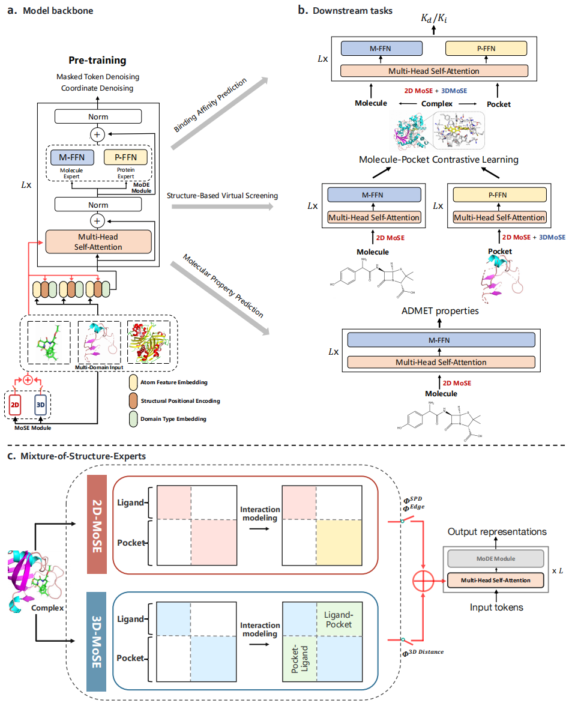

# A Generalist Cross-Domain Molecular Learning Framework for Structure-Based Drug Discovery

This repository is the official implementation of “A Generalist Cross-Domain Molecular Learning Framework for Structure-Based Drug Discovery”, based on the official implementation of [Transformer-M](https://github.com/lsj2408/Transformer-M) and [Fairseq](https://github.com/facebookresearch/fairseq) in [PyTorch](https://github.com/pytorch/pytorch).

## Overview



BIT is a general-purpose pre-trained model designed to encode molecules across various biochemical domains, including small molecules, proteins, and protein-ligand complexes, in different data formats, including 2D and 3D structures. BIT can be fine-tuned as a fusion encoder to model intricate molecular interactions within protein-ligand complexes for precise binding affinity prediction, a dual encoder to enable efficient virtual screening, or a unimodal encoder for modeling small molecules. To achieve this purpose, we treat diverse molecules at the single atom level and introduce a shared Transformer backbone for unified modeling, a unified pre-training strategy to learn more precise cross-domain representations, and a flexible fine-tuning strategy for task-specific adaptation.

## Installation

- Clone this repository

```shell
git clone https://github.com/violet-sto/BIT-Dev.git
```

- Install the dependencies (Using [Anaconda](https://www.anaconda.com/), tested with CUDA version 11.0)

```shell
cd ./BIT-Dev
conda env create -f requirement.yaml
conda activate BIT
pip install torch==1.7.1+cu110 torchvision==0.8.2+cu110 torchaudio==0.7.2 -f https://download.pytorch.org/whl/torch_stable.html
pip install torch_geometric==1.6.3
pip install torch_scatter==2.0.7
pip install torch_sparse==0.6.9
pip install azureml-defaults
pip install rdkit-pypi cython
python setup.py build_ext --inplace
python setup_cython.py build_ext --inplace
pip install -e .
pip install --upgrade protobuf==3.20.1
pip install --upgrade tensorboard==2.9.1
pip install --upgrade tensorboardX==2.5.1
```

## Usage

### Datasets
The raw data of ligands, pockets and complexes can be downloaded in [download link](http://ogb-data.stanford.edu/data/lsc/pcqm4m-v2-train.sdf.tar.gz), [download link](https://www.rcsb.org) and [download link](https://yanglab.qd.sdu.edu.cn/Q-BioLiP).

### Training

- Configuration:

If needed, you can modify run.sh to set parameters for training.

- Training on cross-domain data:

```shell
export data_path='../datasets'
export save_path="../logs/"                         # path to logs
export n_gpu=8
export lr=2e-4                                      # peak learning rate
export warmup_steps=12000                           # warmup steps
export total_steps=200000                           # total steps
export layers=12                                    # set layers=18 for 18-layer model
export complexffn_start_layer=12                    # start layer of complex ffn
export hidden_size=768                              # dimension of hidden layers
export ffn_size=768                                 # dimension of feed-forward layers
export num_head=32                                  # number of attention heads
export batch_size=4                                 # batch size for a single gpu
export max_positions=512                            # max tokens
export dropout=0.0
export act_dropout=0.1
export attn_dropout=0.1
export weight_decay=0.0
export sandwich_ln="false"                          # sub LayerNrom
export droppath_prob=0.1                            # probability of stochastic depth
export noise_scale=0.2                              # noise scale
export mode_prob="0.2,0.2,0.6"                      # mode distribution for {2D+3D, 2D, 3D}
export modality="ligand,pocket,complex"             # input modality. Decide which domain of data to use
export mode_ffn="true"
export mode_2d="true"
export mode_3d="true"
export dataset_name="PCQM4M-LSC-V2-3D"
export add_3d="true"
export num_3d_bias_kernel=128                       # number of Gaussian Basis kernels
export update_freq=4

export use_wandb="false"

bash train.sh
```

- Training on single domain data (ligand、pocket or complex):

```shell
export data_path='../datasets'
export save_path="../logs/"                         # path to logs

export n_gpu=8
export lr=2e-4                                      # peak learning rate
export warmup_steps=12000                           # warmup steps
export total_steps=200000                           # total steps
export layers=12                                    # set layers=18 for 18-layer model
export complexffn_start_layer=12                    # start layer of complex ffn
export hidden_size=768                              # dimension of hidden layers
export ffn_size=768                                 # dimension of feed-forward layers
export num_head=32                                  # number of attention heads
export batch_size=256                               # batch size for a single gpu
export max_positions=512                            # max tokens
export dropout=0.0
export act_dropout=0.1
export attn_dropout=0.1
export weight_decay=0.0
export sandwich_ln="false"                          # sub LayerNrom
export droppath_prob=0.1                            # probability of stochastic depth
export noise_scale=0.2                              # noise scale
export mode_prob="0.2,0.2,0.6"                      # mode distribution for {2D+3D, 2D, 3D}
export modality="ligand" # "pocket" or "complex"    # input modality. Decide which domain of data to use
export mode_ffn="true"                              # mode_ffn controls whether MoDE is used
export mode_2d="true"                               # mode_2d/3d controls whether 2D/3D MoSE is used
export mode_3d="true" 
export dataset_name="PCQM4M-LSC-V2-3D"
export add_3d="true"
export num_3d_bias_kernel=128                       # number of Gaussian Basis kernels
export update_freq=1

export use_wandb="false"

bash train.sh
```

Our model is trained on 64 NVIDIA Tesla V100 GPUs (32GB).
